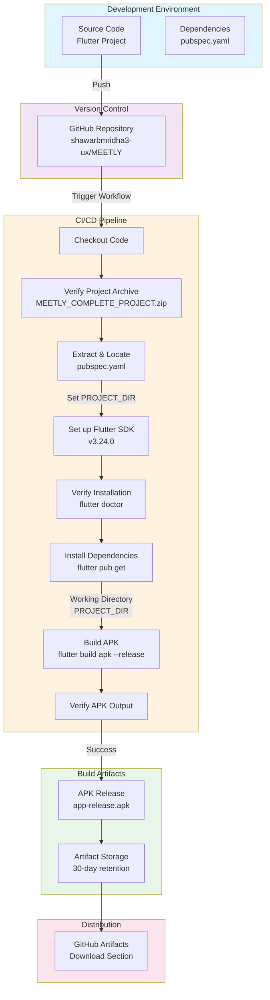

# MEETLY Architecture Overview

## System Architecture

This document provides an architectural overview of the MEETLY Flutter application and its CI/CD pipeline.

## Component Details

### Development Environment
- **Flutter Project**: Mobile application source code written in Dart
- **Dependencies Management**: Managed via `pubspec.yaml` configuration file

### Version Control
- **GitHub Repository**: `shawarbmridha3-ux/MEETLY`
- **Project Archive**: `MEETLY_COMPLETE_PROJECT.zip` containing the complete Flutter project

### CI/CD Pipeline (GitHub Actions)
The build workflow follows these steps:

1. **Code Checkout** - Retrieves the latest code from the repository
2. **Archive Verification** - Ensures the project archive exists before proceeding
3. **Project Extraction** - Unzips the archive and locates the Flutter project structure
4. **Flutter Setup** - Installs Flutter SDK v3.24.0 on the Ubuntu runner
5. **Installation Verification** - Runs `flutter doctor` to validate the environment
6. **Dependency Installation** - Executes `flutter pub get` to fetch all dependencies
7. **APK Build** - Compiles the app into a release APK using `flutter build apk --release`
8. **Output Verification** - Validates that the APK was generated at the expected location
9. **Artifact Upload** - Stores the APK with 30-day retention

### Build Artifacts
- **APK File**: Release-optimized Android application package
- **Storage**: GitHub Artifacts with 30-day retention policy

### Distribution
- **Access Point**: GitHub Artifacts section of the workflow run
- **Format**: Standard Android APK ready for installation

## Build Workflow Trigger
- **Type**: Manual workflow dispatch (`workflow_dispatch`)
- **Platform**: Ubuntu Latest (`ubuntu-latest`)
- **Language**: Dart/Flutter

## Error Handling
The workflow includes comprehensive error checks at each stage:
- Archive existence validation
- `pubspec.yaml` discovery verification
- Dependency installation status checks
- APK build success validation
- APK output path verification

Each step includes detailed logging with success (✓) and failure (❌) indicators for easy troubleshooting.
